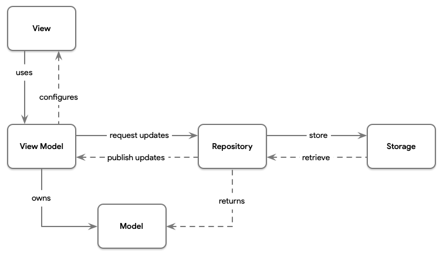

Based on https://www.raywenderlich.com/4161005-mvvm-with-combine-tutorial-for-ios

#  MVVM 1

* The View has a reference to the ViewModel, but not vice-versa.
* The ViewModel has a reference to the Model, but not vice-versa.
* The View has no reference to the Model or vice-versa.
* If you break these rules, you’re doing MVVM wrong!

## MVVM and Data Binding

Data Binding is what allows you to connect a View to its ViewModel. Before this year’s WWDC, you would have to use something akin to RxSwift (via RxCocoa) or ReactiveSwift (via ReactiveCocoa). In this tutorial, you’ll explore how you can achieve this connection using SwiftUI and Combine.

## MVVM With Combine

Combine is not actually necessary for bindings to happen, but this doesn’t mean you can’t harness its power. You can use SwiftUI on its own to create bindings. But using Combine allows more power. As you’ll see throughout the tutorial, once you are on the ViewModel side, using Combine becomes the natural choice. It allows you to cleanly define a chain that starts in your UI, way down to a network call. You can achieve all this power easily by combining (pun intended) SwiftUI and Combine. It’s possible to use another communication pattern (e.g. delegation), but by doing so you are trading the declarative approach set by SwiftUI, and its bindings, for an imperative one.

---

# MVVM 2

[Source](https://medium.com/better-programming/replicating-the-ios-reminders-app-part1-44211a7b7029)

* Views are responsible for displaying data and handling user interaction.
* ViewModels are responsible for providing data to the views and turning user interactions into update requests for the data repositories.
* Models hold the data that the app operates on. They are transferred back and forth between the view models and the repositories.
* Repositories provide an abstraction for the data layer, making it easy to swap out a local storage for a cloud-based storage.

MVVM calls for a 1:1 relationship between views and view models: each view has one view model that all the UI elements are bound to and which will handle any user interaction taking place on this particular screen.
