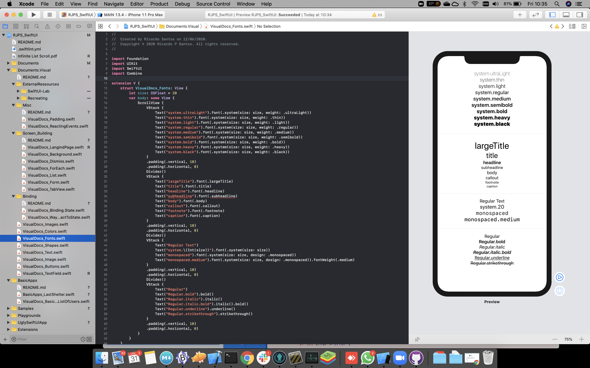
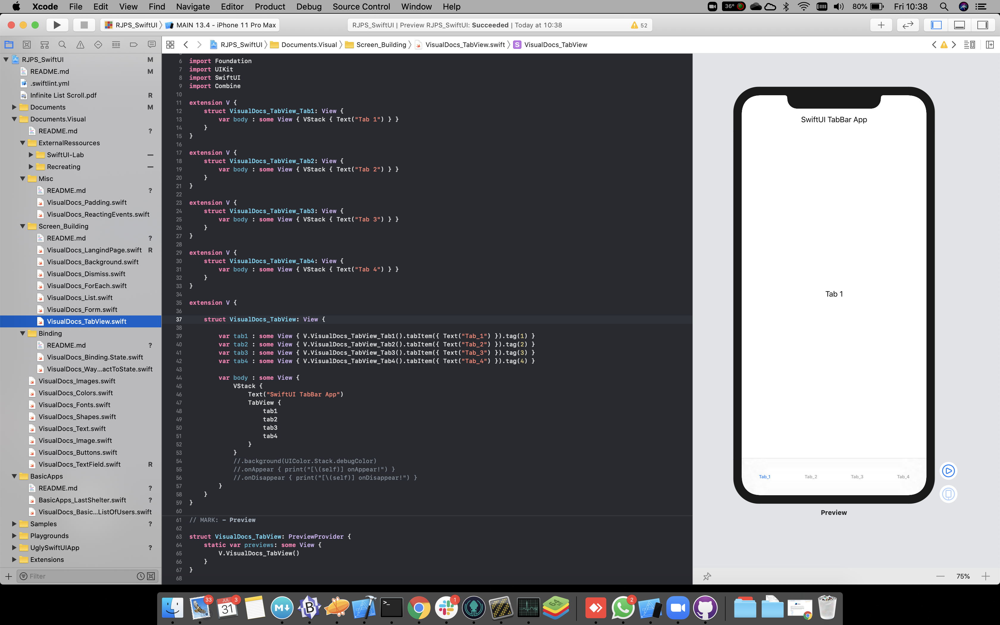
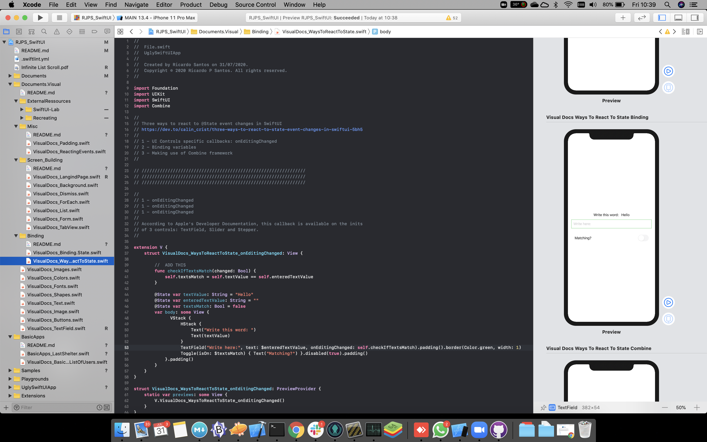
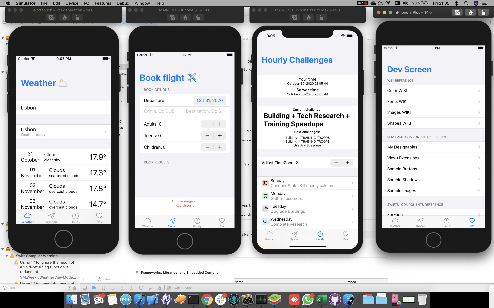

   
    
   
   

## My SwiftUI & Combine Notes

[__CHECK HERE__](https://github.com/ricardopsantos/RJPS_SwiftUI/blob/master/_Documentation_/NotesAndReferences.md)

## Some things you can find on this project...

