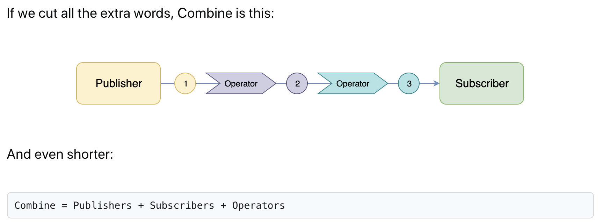
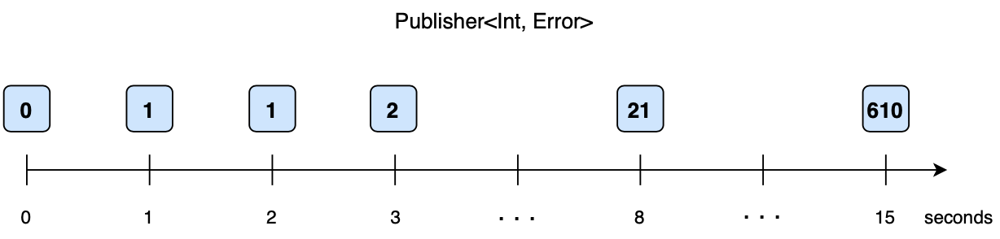
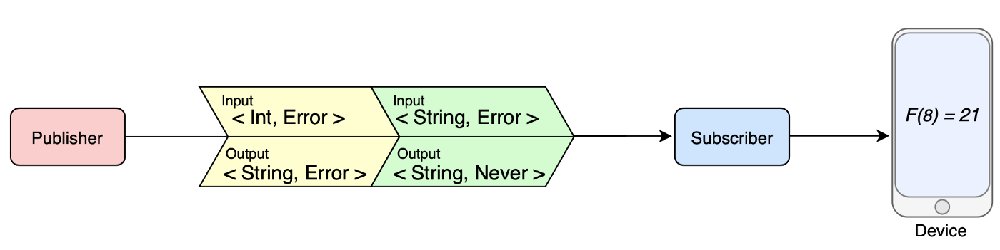
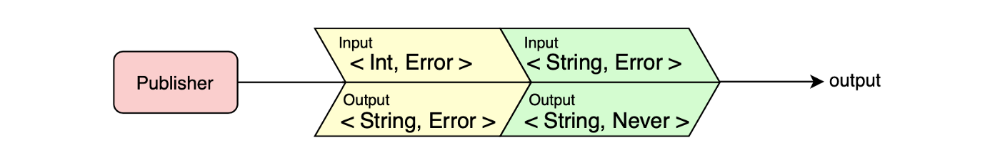

# SwifUI & Combine

## About

__Imperative__: With imperative programming, we’re directly telling the program (or app) what to do and how to do it.

You’re coding: “Put this button here, then download that piece of data, make a decision with if, and finally assign that value to a text label.”

__Declarative__: With declarative programming, we’re merely telling the program (or app) what to do, but not how.

We’re building the logic of a program, without describing its control flow. The actual implementation is up to the program or its frameworks.

## Combine Intro

__Combine = Publishers + Subscribers + Operators__



### Publisher

`Publisher` sends sequences of values over time to one or more `Subscribers`. 

A publisher can send values or terminate with either success or error. `Output` defines what kind of values a publisher can send. Failure defines the type of error it may fail with.

They can emit values over time. Those values are consumed by subscriber instances. In this way, a publisher can emit several events of the following types:
* The publisher’s output value, that’s a generic Output type.
* A successful completion
* An error completion. Failure type that it may publish.

There are four kinds of messages:

* subscription — connection of a subscriber to a publisher
* value — an element in the sequence, the publisher can produce zero or more values
* error — first terminal message. Indicates that sequence ended with error
* complete — second terminal message. Indicates that publisher finished successfully

Apart from that, publisher implements the `receive(subscriber:)` method to connect with a subscriber. In other words, publisher’s output matches with subscriber’s input and the same for the failure types.



### Subscriber

Subscribers, on the other hand, subscribe to one specific publisher instance, and receive a stream of values, until the subscription is canceled.

Any of these chains of publishers and operators end up with a subscriber. This receives those values. Combine provide two built-in subscribers:

* `sink(receiveCompletion:receiveValue:)` : Use os closures to handle elements received and completion events.

* `assign(to:on:)` : Bind the element received in a property of your data model or on a UI control. That property is identified by a key path.



They describe three events that can occur in one’s lifetime and are related to the four messages described above.

* `receive(subscription: Subscription)` : successfully subscribed to the publisher. Called exactly once
* `receive(_ value: Input) -> Subscribers.Demand` : Publisher can provide zero or more values to the Subscriber
* `receive(completion: Subscribers.Completion<Failure>)` : Publisher can send exactly one completion. It can indicate successful completion or error
* 
### Operators

Publishers and subscribers are the backbones of SwiftUI’s two-way synchronization between the UI and the underlying model. I think you will agree that it has never been easier to keep your UI and model in sync than with SwiftUI, and this is all thanks to this part of the Combine framework.
Operators, however, are Combine’s superpower. They are methods that operate on a Publisher, perform some computation, and produce another Publisher in return.

* For example, you can use the `filter` operator to ignore values based on certain conditions
* Or, if you need to perform an expensive task (such as fetching information across the network), you could use the `debounce` operator to wait until the user stops typing
* The `map` operator allows you to transform input values of a certain type into output values of a different type




## Combine

### Combine Sample : Connecting Publisher to Subscriber

Combine has two built-in subscribers: `Subscribers.Sink` and `Subscribers.Assign`. You can connect them by calling either of these methods on a publisher :

* `sink(receiveCompletion:receiveValue:)` to handle new element or completion event in a closure.
* `assign(to:on:)` to write new element to a property.

```swift
// 1
let publisher = Just(1)
// 2
publisher.sink(receiveCompletion: { _ in
    print("finished")
}, receiveValue: { value in
    print(value)
})
```

---

### Combine : `PassthroughSubject`

As in [Apple Docs](https://developer.apple.com/documentation/combine/passthroughsubject) : _A subject that broadcasts elements to downstream subscribers._

__Code Sample__

```swift
class Tab5_ViewRouter: ObservableObject {
    let objectWillChange = PassthroughSubject<Tab5_ViewRouter, Never>() 
    var currentPage: Tab5Pages = .page1 {
        didSet {
            objectWillChange.send(self)
        }
    }
}
```

__Code Sample__

```swift
class SampleUserSettings: ObservableObject {
    let objectWillChange = PassthroughSubject<Void, Never>()
    @UserDefault("ShowOnStart", defaultValue: true)
    var showOnStart: Bool {
        willSet {
            objectWillChange.send()
        }
    }
}
```

---

### `CurrentValueSubject`

As on [Apple Docs](https://developer.apple.com/documentation/combine/currentvaluesubject) : _A subject that wraps a single value and publishes a new element whenever the value changes._

```swift
let var1 = CurrentValueSubject<[String], Never>([])
let var2 = CurrentValueSubject<Int, Never>(0)
let var3 = CurrentValueSubject<Date?, Never>(nil)

var1.sink { print("# var1 : \($0)") }.store(in: &subscriptions)
var2.sink { print("# var2 : \($0)") }.store(in: &subscriptions)
var3.sink { print("# var3 : \($0)") }.store(in: &subscriptions)

var1.send(["test", "test1"])
var2.send(1)
var3.send(Date())
```

---

### `@Published`

As on [Apple Docs](https://developer.apple.com/documentation/combine/published) : _A type that publishes a property marked with an attribute._

@Published is one of the most useful property wrappers in SwiftUI, allowing us to create observable objects that automatically announce when changes occur.

SwiftUI will automatically monitor for such changes, and re-invoke the body property of any views that rely on the data. In practical terms, that means whenever an object with a property marked @Published is changed, all views using that object will be reloaded to reflect those changes.

__Code Sample__ : See @ObservableObjectClass section


## SwiftUI

### SwiftUI : `@State`

As in [Apple Docs](https://developer.apple.com/documentation/swiftui/state) : _A property wrapper type that can read and write a value managed by SwiftUI._

It is local to the view. It has to be a value-type (e.g., a struct, Int, String, Array, etc) and its storage is managed by the framework.

__Code Sample__

```swift
@State private var isShowing: Bool = true 
var toggleView: some View {
    return Toggle(isOn: $isShowing) {
        if isShowing { Text("Toggle On") } 
        else { Text("Toggle Off") }
    }
}
```

__Considerations__

Note that `@State` variables are also great while prototyping your app. For example, if you are working on the layout of your view, you can initially use a `@State` variable to make things easier. Once your view does what you want, you can concentrate on creating your `@BindableObject` and replace your `@State`.

```swift
@Published var wasInitialized = false
@Environment(\.presentationMode) var presentationMode
@ObservedObject var state = InitAnotherViewState()
@State var text = ""
```

---

### SwiftUI : `@Binding`

As stated on [Apple Docs](https://developer.apple.com/documentation/swiftui/binding) : _A property wrapper type that can read and write a value owned by a source of truth._

Use a binding to create a two-way connection between a property that stores data, and a view that displays and changes the data. A binding connects a property to a source of truth stored elsewhere, instead of storing data directly. 

__Code Sample__

```swift
struct PlayButton: View {
    @Binding var bindingVar2: Bool
    var body: some View {
        Button(action: { self.bindingVar2.toggle() }) { Image(systemName: bindingVar2 ? "pause.circle" : "play.circle") }
    }
}

struct VisualDocs_Binding_I: View {
    @State private var bindingVar1: Bool = false
    var body: some View {
        VStack {
            PlayButton(bindingVar2: $bindingVar1)
            if bindingVar1 {
                Text("isPlaying...")
            }
        }
    }
}
```

---

### SwiftUI : `@EnvironmentObject`

As stated on [Apple Docs](https://developer.apple.com/documentation/swiftui/environmentobject) : _A property wrapper type for an observable object supplied by a parent or ancestor view._

An EnvironmentObject is a data model which, once initialised, can share data to all view’s of your app. 

__Code Sample__

```swift
class ObservableObjectClass: ObservableObject {
    @Published var somePublishedVar = 0
}

struct ChangeView_VisualDocs_EnvironmentObject_I_Details_2: View {
    @EnvironmentObject var someEnvironmentObjectB: ObservableObjectClass
    var body: some View {
        VStack {
            Text("Score: \(someEnvironmentObjectB.somePublishedVar)")
            Button("Tap Increase") { self.someEnvironmentObjectB.somePublishedVar += 1 }
        }
    }
}

struct ChangeView_VisualDocs_EnvironmentObject_I_Details_1: View {
    @EnvironmentObject var someEnvironmentObjectB: ObservableObjectClass
    var body: some View {
        VStack {
            Text("Score: \(someEnvironmentObjectB.somePublishedVar)")
            Button("Tap Increase") { self.someEnvironmentObjectB.somePublishedVar += 1 }
        }
    }
}

struct VisualDocs_EnvironmentObject_I: View {
    @ObservedObject var someObservedObject = ObservableObjectClass()
    var body: some View {
        NavigationView {
            VStack(spacing: 30) {
                Text("Score: \(someObservedObject.somePublishedVar)")
                NavigationLink(destination: ChangeView_VisualDocs_EnvironmentObject_I_Details_1()) {
                    Text("Show Detail View 1")
                }
                NavigationLink(destination: ChangeView_VisualDocs_EnvironmentObject_I_Details_2()) {
                    Text("Show Detail View 2")
                }
            }
        }
        .environmentObject(someObservedObject)
    }
}
```

__More__

* [How to navigate between views in SwiftUI by using an @EnvironmentObject](https://www.blckbirds.com/post/how-to-navigate-between-views-in-swiftui-by-using-an-environmentobject)

---

### SwiftUI : `@ObservedObject`

As on [Apple Docs](https://developer.apple.com/documentation/swiftui/ObservedObject) : _A property wrapper type that subscribes to an observable object and invalidates a view whenever the observable object changes._

It is external to the view, it is a reference value (e.g., a class) and its storage is managed by you, giving you more flexibility to implement your own logic.

__Code Sample__ : See section @EnvironmentObject

## SwiftUI References

* [Fucking SwiftUI](https://fuckingswiftui.com/)
* [The Complete SwiftUI Documentation You’ve Been Waiting For](https://medium.com/better-programming/the-complete-swiftui-documentation-youve-been-waiting-for-fdfe7241add9)
* [Fucking SwiftUI](https://fuckingswiftui.com)
* [SwiftUI tips and tricks](https://www.hackingwithswift.com/quick-start/swiftui/swiftui-tips-and-tricks)
* [SwiftUI Framework Learning and Usage Guide](https://jinxiansen.github.io/SwiftUI/)
* [How to use UIKit in SwiftUI](https://sarunw.com/posts/uikit-in-swiftui)
* [swiftui-lab](https://gist.github.com/swiftui-lab)
* [About SwiftUI](https://github.com/swiftui-lab/About-SwiftUI)

## Combine References
* [Basics of the Combine framework](https://levelup.gitconnected.com/basics-of-combine-framework-64dbd18da341)
* [Swift Combine Framework Tutorial: Getting Started](https://www.vadimbulavin.com/swift-combine-framework-tutorial-getting-started/)
* [The difference between @StateObject, @EnvironmentObject, and @ObservedObject in SwiftUI](https://swiftwithmajid.com/2020/07/02/the-difference-between-stateobject-environmentobject-and-observedobject-in-swiftui/)

